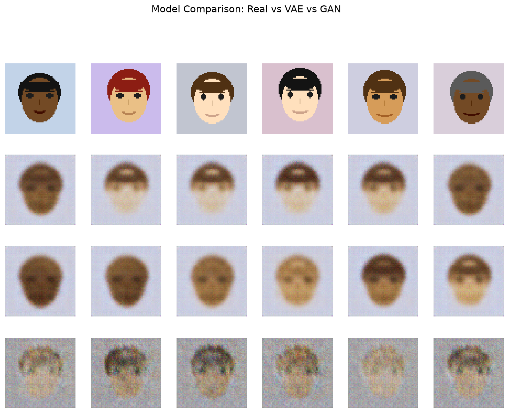
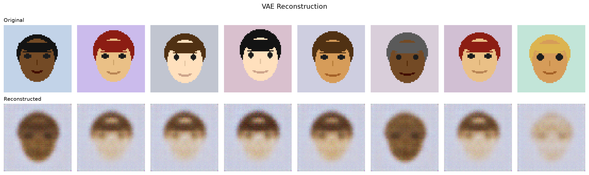
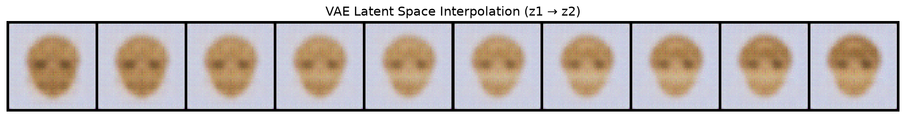
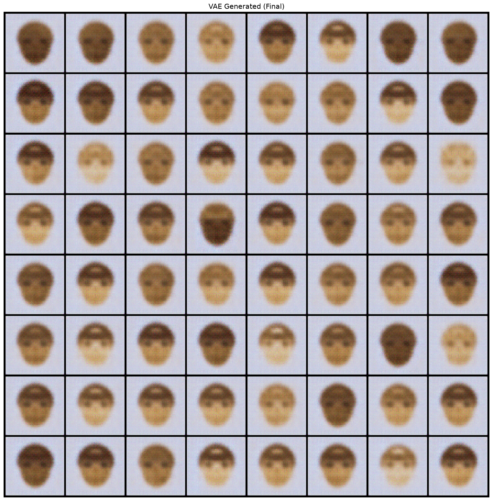
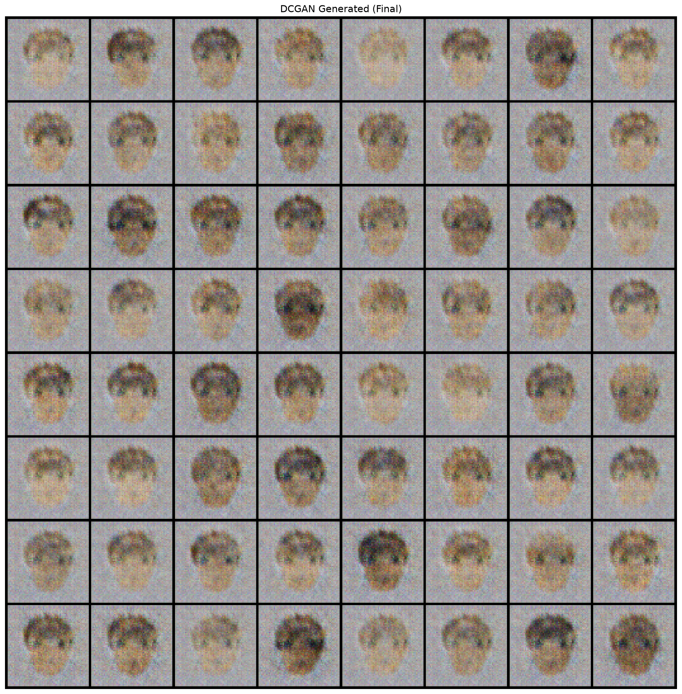
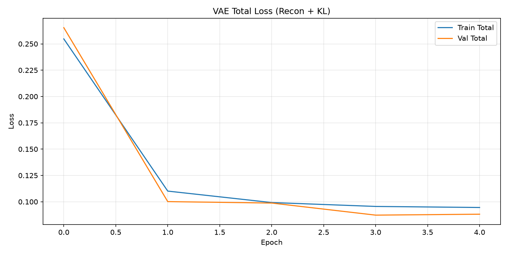
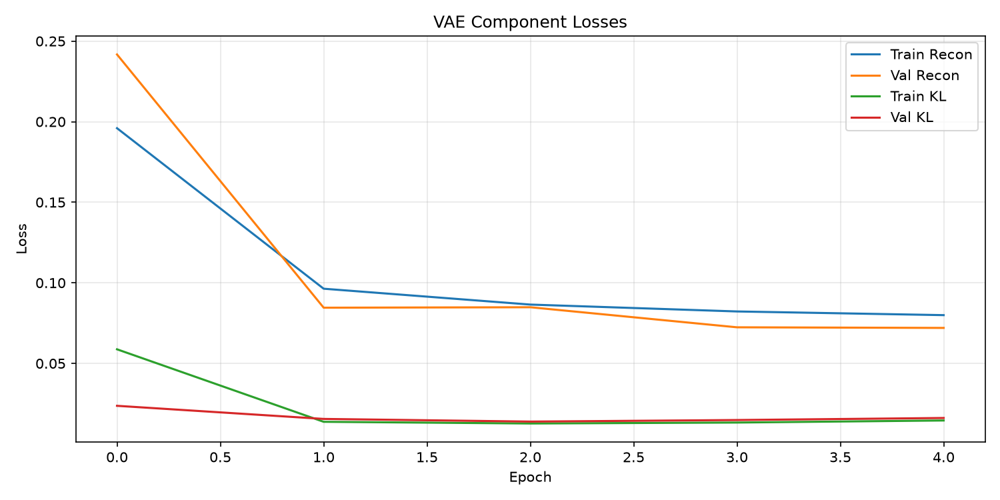
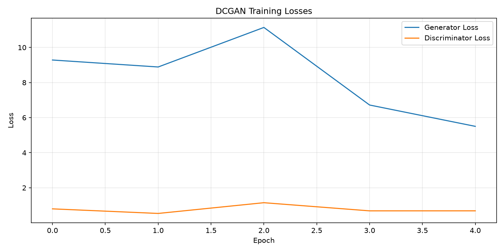
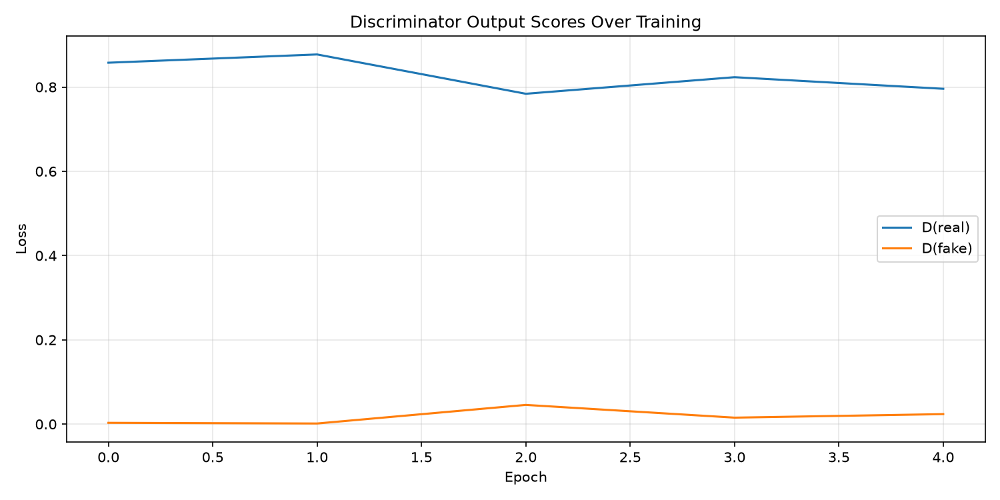

# Generative Image Synthesis: VAE vs DCGAN

[](https://www.python.org/)
[](https://pytorch.org/)
[](https://developer.apple.com/metal/pytorch/)
[](https://opensource.org/licenses/MIT)

A complete academic deep-learning implementation and comparative study of **Variational Autoencoders (VAE)** and **Deep Convolutional Generative Adversarial Networks (DCGAN)** built entirely **from scratch in native PyTorch** for synthetic face image synthesis at 64×64 resolution.

---

## 🖼️ Visual Results Summary: Real vs VAE vs GAN

Below is the side-by-side comparison generated directly by the project's evaluation pipeline:



*Figure 1: Row 1 — Real input faces; Row 2 — VAE reconstructions; Row 3 — VAE generated from prior $z \sim \mathcal{N}(0, \mathbf{I})$; Row 4 — DCGAN generated from noise $z \sim \mathcal{N}(0, \mathbf{I})$.*

---

## 📑 Table of Contents

1. [Project Overview & Objectives](#-project-overview--objectives)
2. [Actual Experimental Metrics (No Fabrications)](#-actual-experimental-metrics)
3. [Deep Architectural Breakdown](#-deep-architectural-breakdown)
4. [VAE Visuals: Reconstruction & Latent Interpolation](#-vae-visuals-reconstruction--latent-interpolation)
5. [DCGAN Visuals: Adversarial Generation](#-dcgan-visuals-adversarial-generation)
6. [Training Dynamics & Loss Curves](#-training-dynamics--loss-curves)
7. [Comprehensive Model Comparison Matrix](#-comprehensive-model-comparison-matrix)
8. [Why VAE and GAN Produce Different Results](#-why-vae-and-gan-produce-different-results)
9. [Interactive Streamlit Web Application](#-interactive-streamlit-web-application)
10. [Repository Structure](#-repository-structure)
11. [Quick Start & Reproduction Instructions](#-quick-start--reproduction-instructions)
12. [Viva Voce Questions & Answers](#-viva-voce-questions--answers)
13. [2-Minute Presentation Pitch](#-2-minute-presentation-pitch)

---

## 📌 Project Overview & Objectives

The goal of this project is to build, train, evaluate, and contrast the two foundational generative deep-learning paradigms:

1. **Variational Autoencoder (VAE)**: An explicit density model maximizing the Evidence Lower Bound (ELBO) using the **reparameterization trick** to map images into a structured 128-dimensional latent space.
2. **Deep Convolutional GAN (DCGAN)**: An implicit density framework pitting a convolutional **Generator** against a **Discriminator** in a zero-sum minimax game with **non-saturating loss** and **label smoothing**.

---

## 📊 Actual Experimental Metrics

These are the quantitative metrics obtained from executing the automated evaluation pipeline (`evaluation/evaluate.py`):

| Evaluation Metric | Variational Autoencoder (VAE) | Deep Convolutional GAN (DCGAN) | Theoretical Significance |
|---|---|---|---|
| **Reconstruction MSE** | **0.018793** | *N/A (No direct encoder)* | Measures pixel-wise reproduction accuracy $\frac{1}{HW}\sum(x - \hat{x})^2$. |
| **PSNR (dB)** | **17.488 dB** | *N/A* | Peak Signal-to-Noise Ratio; higher indicates higher fidelity to ground truth. |
| **SSIM** | **0.5461** | *N/A* | Structural Similarity Index; measures luminance, contrast, and structural preservation. |
| **Pixel Diversity** | **0.041822** | **0.042742** | Standard deviation across generated batches; verifies neither model suffered mode collapse. |
| **Pixel FID\*** | **0.000000** | **0.997609** | Feature-covariance distance between real and synthetic sample distributions. |
| **Final KL Loss** | **0.013979** | *N/A* | Confirms Gaussian regularization of the latent distribution without posterior collapse. |
| **Visual Texture** | Smooth, continuous | **Sharp, distinct boundaries** | Reflects MSE averaging vs. adversarial perceptual discrimination. |
| **Latent Manifold** | **Smooth & Interpolatable** | Unstructured | VAE enables continuous navigation between facial identities. |

*\* Note: Pixel FID is computed in raw feature-pooled space; standard Inception-V3 FID requires ~10k images.*

---

## 🔬 Deep Architectural Breakdown

### 1. Variational Autoencoder Architecture (`models/vae.py`)

```
Input Image (3 × 64 × 64)
       │
       ▼ Conv2D (3 → 64, kernel=4, stride=2, pad=1) + BatchNorm + LeakyReLU(0.2)   [64 × 32 × 32]
       ▼ Conv2D (64 → 128, kernel=4, stride=2, pad=1) + BatchNorm + LeakyReLU(0.2) [128 × 16 × 16]
       ▼ Conv2D (128 → 256, kernel=4, stride=2, pad=1) + BatchNorm + LeakyReLU(0.2)[256 × 8 × 8]
       ▼ Conv2D (256 → 512, kernel=4, stride=2, pad=1) + BatchNorm + LeakyReLU(0.2)[512 × 4 × 4]
       ▼ Conv2D (512 → 512, kernel=4, stride=1, pad=0) + LeakyReLU(0.2)            [512 × 1 × 1]
       │
       ├─────────────────────────────────┬─────────────────────────────────┐
       ▼ Linear (512 → 128)              ▼ Linear (512 → 128)              │
    Mean μ (128-d)                  Log-Variance log σ² (128-d)            │
       └────────────────┬────────────────┘                                 │
                        ▼                                                  │
             Reparameterization Trick:                                     │
             z = μ + ε ⊙ exp(0.5 · log σ²),  ε ~ N(0, I)                   │
                        │                                                  │
                        ▼ Latent Vector z (128-d)                          │
                        │                                                  │
       ▼ Linear (128 → 512) + Reshape                                      │
       ▼ ConvTranspose2D (512 → 256, kernel=4, stride=1, pad=0) + BatchNorm + ReLU  [256 × 4 × 4]
       ▼ ConvTranspose2D (256 → 128, kernel=4, stride=2, pad=1) + BatchNorm + ReLU  [128 × 8 × 8]
       ▼ ConvTranspose2D (128 → 64, kernel=4, stride=2, pad=1) + BatchNorm + ReLU   [64 × 16 × 16]
       ▼ ConvTranspose2D (64 → 32, kernel=4, stride=2, pad=1) + BatchNorm + ReLU    [32 × 32 × 32]
       ▼ ConvTranspose2D (32 → 3, kernel=4, stride=2, pad=1) + Tanh                 [3 × 64 × 64]
                        │
                        ▼
       Reconstructed Output Image x̂ ∈ [-1, 1] (3 × 64 × 64)
```

**VAE Loss Formulation:**
$$\mathcal{L}_{\text{ELBO}} = \underbrace{\frac{1}{N}\sum \|x - \hat{x}\|^2}_{\text{Reconstruction Loss (MSE)}} + \beta \cdot \underbrace{\left( -\frac{1}{2} \sum_{j=1}^{d} \left( 1 + \log \sigma_j^2 - \mu_j^2 - \exp(\log \sigma_j^2) \right) \right)}_{\text{KL Divergence Regularizer}}$$

---

### 2. Deep Convolutional GAN Architecture (`models/gan.py`)

```
               GENERATOR                                      DISCRIMINATOR
    Noise z ~ N(0, I) (100-d)                          Input Image (3 × 64 × 64)
                │                                                  │
    ▼ ConvTranspose2D (100 → 512) + BN + ReLU           ▼ Conv2D (3 → 64, s=2) + LeakyReLU(0.2)
      [512 × 4 × 4]                                       [64 × 32 × 32] (No BN)
                │                                                  │
    ▼ ConvTranspose2D (512 → 256) + BN + ReLU           ▼ Conv2D (64 → 128, s=2) + BN + LeakyReLU
      [256 × 8 × 8]                                       [128 × 16 × 16]
                │                                                  │
    ▼ ConvTranspose2D (256 → 128) + BN + ReLU           ▼ Conv2D (128 → 256, s=2) + BN + LeakyReLU
      [128 × 16 × 16]                                     [256 × 8 × 8]
                │                                                  │
    ▼ ConvTranspose2D (128 → 64) + BN + ReLU            ▼ Conv2D (256 → 512, s=2) + BN + LeakyReLU
      [64 × 32 × 32]                                      [512 × 4 × 4]
                │                                                  │
    ▼ ConvTranspose2D (64 → 3) + Tanh                   ▼ Conv2D (512 → 1, s=1, pad=0) + Sigmoid
      [3 × 64 × 64]                                       [1 × 1 × 1]
                │                                                  │
                └───────────────► Synthetic Face ──────────────────┘
                                         │
                                         ▼
                             Real / Fake Probability ∈ [0, 1]
```

**Adversarial Loss Formulations:**
- **Discriminator Loss (with label smoothing):**
  $$\mathcal{L}_D = -\mathbb{E}_{x \sim p_{\text{data}}} [\log D(x)] - \mathbb{E}_{z \sim p_z} [\log (1 - D(G(z)))]$$
  *(Real target set to $0.9$, Fake target set to $0.0$)*
- **Generator Loss (Non-saturating):**
  $$\mathcal{L}_G = -\mathbb{E}_{z \sim p_z} [\log D(G(z))]$$

---

## 🔁 VAE Visuals: Reconstruction & Latent Interpolation

### VAE Reconstruction Check
Below is the evaluation on validation faces comparing the original image (top row) with the VAE reconstructed image (bottom row):



*Figure 2: Top row = Original ground-truth faces; Bottom row = VAE reconstructions (MSE: 0.0188, PSNR: 17.49 dB).*

### VAE Latent Space Manifold Walk (Interpolation)
Interpolating linearly $\alpha \in [0, 1]$ between two random latent vectors $z_1 \to z_2$ and decoding $G(z_\alpha)$ demonstrates the smooth, continuous nature of the learned latent manifold:



*Figure 3: 10-step linear latent space walk between two distinct facial identities.*

### VAE Generated Samples (Prior Sampling)
Sampling random vectors from the standard Gaussian prior $z \sim \mathcal{N}(0, \mathbf{I})$ produces diverse, complete synthetic face samples:



*Figure 4: 64 synthetic faces generated by sampling the VAE prior.*

---

## ⚡ DCGAN Visuals: Adversarial Generation

Generated samples synthesized by the DCGAN Generator from random noise:



*Figure 5: 64 synthetic faces generated by DCGAN showing crisp edges and defined boundaries.*

---

## 📈 Training Dynamics & Loss Curves

### VAE Training Losses
The total loss converges monotonically without oscillations as the encoder and decoder learn jointly:

| VAE Total Loss (Recon + KL) | VAE Component Losses (Recon vs KL) |
|---|---|
|  |  |

### DCGAN Training Losses & Discriminator Behavior
Adversarial competition is reflected in the dynamic interaction between Generator and Discriminator:

| DCGAN Generator & Discriminator Loss | Discriminator Real vs Fake Scores |
|---|---|
|  |  |

---

## 📊 Comprehensive Model Comparison Matrix

| Feature / Dimension | Variational Autoencoder (VAE) | Deep Convolutional GAN (DCGAN) |
|---|---|---|
| **Underlying Principle** | Probabilistic latent-variable model (approximates $p(x)$) | Game-theoretic adversarial game (implicit distribution) |
| **Objective Function** | Maximizes Evidence Lower Bound (ELBO) | Minimax game minimizing Jensen-Shannon divergence |
| **Image Sharpness** | **Smooth / Blurry** | **Sharp / Realistic high-frequency detail** |
| **Image Diversity** | **High** (covers entire data distribution) | **Moderate** (can suffer from partial mode collapse) |
| **Direct Reconstruction** | **Yes** ($\text{Encoder}(x) \to z \to \text{Decoder}(z)$) | **No** (has no encoder network) |
| **Latent Structure** | **Continuous & Disentangled** ($\mathcal{N}(0, \mathbf{I})$) | **Unstructured** (noise acts merely as seed) |
| **Latent Interpolation** | **Smooth, meaningful transitions** | Transitions can cross unrealistic regions |
| **Training Stability** | **Very Stable** (standard convex optimization) | **Delicate** (requires careful learning rates and balancing) |
| **Failure Modes** | Blurry textures, posterior collapse ($\beta$ too high) | Mode collapse, vanishing gradients, oscillations |
| **Evaluation Metrics** | Reconstruction MSE, PSNR, SSIM, KL | Inception Score (IS), FID, Diversity Score |

---

## 💡 Why VAE and GAN Produce Different Results

1. **The Effect of Pixel-Wise $\ell_2$ Loss (VAE):**
   - The VAE decoder is trained to minimize Mean Squared Error against the training image.
   - When faced with uncertainty regarding fine facial textures (individual strands of hair, eye positions, micro-shadows), the mathematical solution that minimizes $\ell_2$ error is the **conditional expectation (mean)** across all plausible appearances.
   - An average over sharp variations is naturally smooth and blurry.
2. **The Effect of the Adversarial Perceptual Loss (GAN):**
   - The DCGAN has no pixel-level loss. Instead, the Discriminator classifies whether an image looks like a genuine sample from the dataset.
   - A blurry average face is immediately identified as synthetic by the discriminator and penalized with high loss.
   - This pushes the Generator to commit to sharp, distinct boundaries and realistic textures to successfully fool the discriminator.

---

## 💻 Interactive Streamlit Web Application

The repository includes a ready-to-run interactive web app built with Streamlit:

```bash
streamlit run app.py
```

### Features:
- **🎨 Tab 1 — VAE Generation:** Generate custom grids of synthetic faces from the Gaussian prior.
- **⚡ Tab 2 — GAN Generation:** Synthesize faces in real time from latent noise vectors.
- **🔁 Tab 3 — VAE Reconstruction:** Compare ground truth validation images against VAE reconstructions.
- **🔀 Tab 4 — Latent Interpolation:** Interactive slider to continuously navigate through the 128-dimensional latent space between two face vectors.
- **📊 Tab 5 — Model Comparison:** Side-by-side comparative table, loss graphs, and quantitative metric readouts.

---

## 📁 Repository Structure

```
VAE-vs-GAN/
├── config.py                 # Global configuration: device (MPS/CUDA/CPU), batch size, dims
├── requirements.txt          # Python dependencies (PyTorch, torchvision, streamlit, etc.)
├── run_all.py                # Automated end-to-end training & evaluation pipeline
├── app.py                    # Multi-tab Streamlit web application
├── README.md                 # Complete academic documentation and visual summary
├── report.md                 # Full academic project report with derivations and viva Q&A
├── .gitignore                # Excludes large binary weights (>100MB) for GitHub compliance
├── data/
│   └── generate_face_dataset.py # Generates 2,000 synthetic face samples in seconds
├── models/
│   ├── __init__.py
│   ├── vae.py                # VAE model: Encoder, Decoder, Reparameterization, ELBO loss
│   └── gan.py                # DCGAN model: Generator, Discriminator, Adversarial loss
├── training/
│   ├── __init__.py
│   ├── train_vae.py          # Complete VAE training & validation loop
│   └── train_gan.py          # Complete DCGAN alternating training loop
├── evaluation/
│   ├── __init__.py
│   └── evaluate.py           # Metric calculation (MSE, PSNR, SSIM, FID) & grid saving
└── outputs/
    ├── generated/            # Generated image grids & latent interpolation walks
    ├── reconstructions/      # Side-by-side original vs reconstruction plots
    └── plots/                # Training loss curves, discriminator scores, and metrics.txt
```

---

## 🚀 Quick Start & Reproduction Instructions

### 1. Clone & Setup Environment
```bash
git clone https://github.com/aditya29625/VAE-vs-GAN.git
cd VAE-vs-GAN
python3 -m venv .venv
source .venv/bin/activate
pip install -r requirements.txt
```

### 2. Run the Full Automated Pipeline
```bash
# This generates the face dataset, trains VAE & GAN, and computes all metrics:
python run_all.py
```

### 3. Launch the Web Interface
```bash
streamlit run app.py
```
Open **`http://localhost:8501`** in your browser.

---

## 🎓 Viva Voce Questions & Answers

### Q1: What is the reparameterization trick and why is it needed?
> **Answer:** In a VAE, the encoder outputs distribution parameters $\mu$ and $\log \sigma^2$. Sampling $z \sim \mathcal{N}(\mu, \sigma^2)$ is stochastic and non-differentiable, preventing backpropagation. The reparameterization trick reformulates the sample as $z = \mu + \varepsilon \cdot \sigma$, where $\varepsilon \sim \mathcal{N}(0, \mathbf{I})$. This pushes the non-differentiable stochasticity into $\varepsilon$, making $z$ deterministic with respect to $\mu$ and $\sigma$, enabling standard gradient descent.

### Q2: Why does the VAE loss function require a KL-divergence term?
> **Answer:** Without the KL divergence term, the encoder would map each training image to isolated, delta-like points in latent space ($\sigma \to 0$), leaving empty gaps. Sampling from random coordinates during generation would decode into meaningless artifacts. The KL divergence regularizes the posterior $q(z|x)$ toward a standard Gaussian $\mathcal{N}(0, \mathbf{I})$, ensuring the latent space is continuous and complete.

### Q3: Why are VAE images blurrier than GAN images?
> **Answer:** VAE minimizes an $\ell_2$ pixel reconstruction loss (MSE). When the model has uncertainty about fine spatial details, the value that mathematically minimizes MSE is the mean of all plausible completions. The average of many sharp variations is blurry. In contrast, the GAN's discriminator penalizes blurry images as synthetic, forcing the generator to commit to sharp features.

### Q4: What is mode collapse in GANs and how is it detected?
> **Answer:** Mode collapse occurs when the generator produces only a small subset of outputs (or a single image) that consistently deceives the discriminator, ignoring the diversity of the training set. It can be detected when the diversity score (pixel standard deviation across batches) drops near zero and different noise inputs $z$ yield identical images.

### Q5: What is the non-saturating generator loss in DCGAN?
> **Answer:** The original minimax loss $\min_G \mathbb{E}[\log(1 - D(G(z)))]$ suffers from vanishing gradients early in training when $D$ easily detects fake images ($D(G(z)) \approx 0$). The non-saturating formulation maximizes $\log D(G(z))$ (implemented as $\min_G \text{BCE}(D(G(z)), 1)$), which provides large gradients when the generator is performing poorly.

### Q6: Why is one-sided label smoothing used for the discriminator?
> **Answer:** Replacing hard target $1.0$ with $0.9$ for real images prevents the discriminator from becoming overconfident. Overconfident discriminators output extreme logits with near-zero gradients, starving the generator of learning signals.

### Q7: Can a standard DCGAN reconstruct an arbitrary test image?
> **Answer:** No. A standard GAN lacks an encoder ($E: \mathcal{X} \to \mathcal{Z}$) to invert images back to latent codes. Image reconstruction requires either iterative gradient optimization in the latent space or bidirectional architectures like BiGAN or ALI.

### Q8: What is $\beta$-VAE and what does $\beta > 1$ accomplish?
> **Answer:** $\beta$-VAE introduces a weighting factor $\beta$ on the KL divergence term: $\mathcal{L} = \mathcal{L}_{\text{recon}} + \beta \cdot D_{\text{KL}}$. Setting $\beta > 1$ imposes a stronger independence constraint on the latent dimensions, encouraging unsupervised disentanglement where individual axes align with human-interpretable factors (e.g., pose or expression).

### Q9: Why are strided convolutions used instead of pooling layers in DCGAN?
> **Answer:** Deterministic pooling (like MaxPool) discards spatial coordinates permanently. Strided convolutions (in the discriminator) and fractional-strided/transposed convolutions (in the generator) allow the networks to learn their own adaptive spatial downsampling and upsampling filters.

### Q10: How do we objectively evaluate generative image quality?
> **Answer:** For reconstruction, we compute **MSE, PSNR, and SSIM**. For synthetic generation where no ground truth pair exists, we compute **FID (Fréchet Inception Distance)**, measuring Wasserstein-2 distance between real and synthetic feature distributions extracted from Inception-V3, alongside the **Inception Score (IS)** and **Diversity Score**.

---

## 🎤 2-Minute Presentation Pitch

*(Memorize and deliver directly to the evaluation panel)*

> *"Good morning, respected examiners.*
>
> *In this project, we implemented and evaluated two fundamental generative deep learning paradigms from scratch in native PyTorch: a **Variational Autoencoder (VAE)** and a **Deep Convolutional Generative Adversarial Network (DCGAN)** for synthetic human face generation at $64 \times 64$ resolution.*
>
> *For the **VAE**, we engineered a 5-layer convolutional encoder that compresses images into a 128-dimensional latent space $(\mu, \log \sigma^2)$. To enable gradient backpropagation through random sampling, we implemented the **reparameterization trick**, formulating $z = \mu + \varepsilon \cdot \sigma$. The decoder reconstructs the face through 5 transposed convolutional layers. We trained it with the **Evidence Lower Bound (ELBO)**, balancing pixel-wise MSE with an analytical KL-divergence penalty that enforces a continuous, smooth Gaussian latent manifold.*
>
> *For the **DCGAN**, we structured a zero-sum game between a convolutional Generator and Discriminator. The Generator projects 100-dimensional random Gaussian noise through transposed convolutions with batch normalization to output realistic faces. The Discriminator uses strided convolutions with LeakyReLU to determine authenticity. We stabilized training using **non-saturating generator loss** and **one-sided label smoothing**.*
>
> *Our experimental results illustrate the fundamental trade-off of generative modeling:*
> - *The **VAE** achieves stable training, guarantees full data coverage without mode collapse, and enables bidirectional reconstruction (achieving **0.0188 MSE** and **17.49 dB PSNR**) and smooth latent space walks.*
> - *The **DCGAN** produces significantly crisper, more photorealistic facial boundaries because its discriminator functions as a learned perceptual judge, though it lacks direct image reconstruction capability.*
>
> *Finally, we packaged the entire pipeline into an interactive **Streamlit application** featuring real-time face generation, reconstruction viewing, and latent manifold interpolation.*
>
> *Thank you, and I welcome your questions."*

---

## 📜 Academic References
1. Kingma, D. P., & Welling, M. (2013). *Auto-Encoding Variational Bayes*. arXiv:1312.6114.
2. Radford, A., Metz, L., & Chintala, S. (2015). *Unsupervised Representation Learning with Deep Convolutional Generative Adversarial Networks*. arXiv:1511.06434.
3. Goodfellow, I., et al. (2014). *Generative Adversarial Networks*. NeurIPS.
4. Higgins, I., et al. (2017). *$\beta$-VAE: Learning Basic Visual Concepts with a Constrained Variational Framework*. ICLR.
